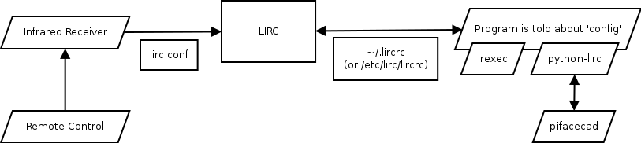

####
LIRC
####

This page contains some information about `Linux Infrared Remote Control
(LIRC) <http://www.lirc.org/>`_ and how to set it up with PiFace CAD and
the Raspberry Pi.

LIRC looks something like this:

Setting up the Infrared Receiver
================================
Download and run the setup script::

    $ wget https://raw.github.com/piface/pifacecad/master/bin/setup_pifacecad_lirc.sh
    $ chmod +x setup_pifacecad_lirc.sh
    $ sudo ./setup_pifacecad_lirc.sh

Alternatively you can set up the receiver manually.

.. note:: The following instructions are for a manual set up of the above
          script. If you have run the script above, you can skip straight
          to :ref:`configuring-lirc`.

First, install lirc::

    $ sudo apt-get install lirc

The latest version of Raspbian should contain the ``lirc_rpi`` kernel module.
It allows you to specify which GPIO pin the Infrared Receiver is attached to.
On PiFace CAD, the Infrared Receiver is connected to GPIO pin 23. To load the
module type::

    $ sudo modprobe lirc_rpi gpio_in_pin=23

You can test that it works with the ``mode2`` program::

    $ sudo kill $(pidof lirc)  # stop lirc using /dev/lirc0
    $ mode2 -d /dev/lirc0

If, after pressing some buttons, you get a series of pulse/space lengths then
your Infrared Receiver is working. To make sure that the module is loaded
each time you boot, add the following lines to ``/etc/modules``::

    lirc_dev
    lirc_rpi gpio_in_pin=23

Update ``/etc/lirc/hardware.conf`` to contain the following::

    # /etc/lirc/hardware.conf
    #
    # Arguments which will be used when launching lircd
    LIRCD_ARGS="--uinput"

    #Don't start lircmd even if there seems to be a good config file
    #START_LIRCMD=false

    #Don't start irexec, even if a good config file seems to exist.
    #START_IREXEC=false

    #Try to load appropriate kernel modules
    LOAD_MODULES=true

    # Run "lircd --driver=help" for a list of supported drivers.
    DRIVER="default"
    # usually /dev/lirc0 is the correct setting for systems using udev
    DEVICE="/dev/lirc0"
    MODULES="lirc_rpi"

    # Default configuration files for your hardware if any
    LIRCD_CONF=""
    LIRCMD_CONF=""

Finally, reboot your Rasbperry Pi::

    $ sudo reboot

.. _configuring-lirc:

Configuring LIRC
================

See also: http://www.lirc.org/html/configure.html

lircd.conf
----------

The ``/etc/lirc/lircd.conf`` file tells LIRC about your remote control. Since every
remote control is different, you need to generate a different config for each
remote. Alternatively you could try and find your remote control config file
here: http://lirc.sourceforge.net/remotes/.

To generate your own configuration run::

    $ sudo irrecord -f -d /dev/lirc0 /etc/lirc/lircd.conf

and carefully follow the on-screen instructions. At some point it will ask you
to enter the commands for each button you press. You can list the available
commands (in another terminal) with::

    $ irrecord --list-namespace

After you have finished, restart the lirc daemon (or reboot) and test your
remote by running::

    $ irw

Your commands should appear in the console.

~/.lircrc (or /etc/lirc/lircrc)
-------------------------------

The ``~/.lircrc`` file is used to configure what other programs see from LIRC.
See examples in :ref:`ref-irexec` and :ref:`ref-python-lirc`.

See also: http://www.lirc.org/html/configure.html#lircrc_format

.. _ref-irexec:

irexec
======

`irexec <See also: http://www.lirc.org/html/irexec.html>`_ is a program that runs commands mapped to IR signals. It is configured using the ~/.lircrc file.

Simple ~/.lircrc::

    begin
        prog = irexec
        button = KEY_1
        config = echo "You pressed one"
        repeat = 0
    end

Now when you run ``irexec`` and press 1 on the remote control *You pressed one*
will be printed to the console::

    $ irexec
    You pressed one
    You pressed one
    You pressed one

Here is another example that uses ``mpc`` to control `Music Player Daemon
<http://www.musicpd.org/>`_::

    begin
        prog = irexec
        button = KEY_PREVIOUSSONG
        config = mpc prev
        repeat = 0
    end
    begin
        prog = irexec
        button = KEY_NEXTSONG
        config = mpc next
        repeat = 0
    end
    begin
        prog = irexec
        button = KEY_PLAY
        config = mpc play
        repeat = 1
    end

.. _ref-python-lirc:

python-lirc
===========

`python-lirc <https://github.com/tompreston/python-lirc>`_ is a Python
extension that allows us to access configs in ~/.lircrc when LIRC receives
a signal.

First we need to add more configurations to our ~/.lircrc::

    begin
        prog = irexec
        button = KEY_1
        config = echo "You pressed one"
        repeat = 0
    end

    begin
      prog = myprogram
      button = KEY_1
      config = one
    end

    begin
      prog = myprogram
      button = KEY_1
      config = two
    end

Then we can wait for IR codes in Python::

    $ python3
    >>> import lirc
    >>> sockid = lirc.init("myprogram")
    >>> lirc.nextcode()  # press 1 on remote after this
    ['one']
    >>> lirc.nextcode()  # press 2 on remote after this
    ['two']

PiFace CAD
==========

PiFace Control and Display provides a wrapper around python-lirc. An example of
how to use it can be found in `Examples <example.html#ir-receiver>`_.
